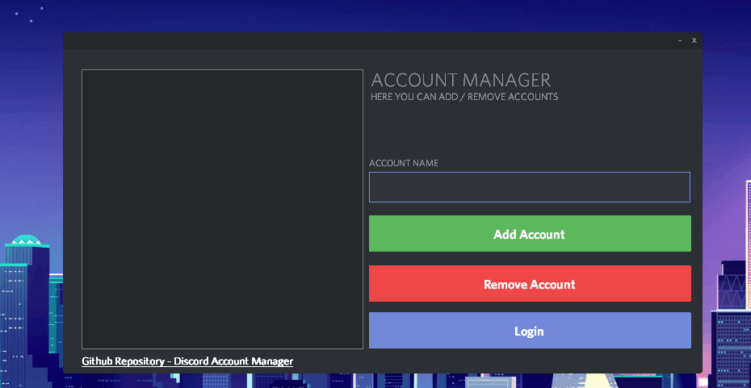

# DAM (Discord Account Manager)
DAM Allows your to swiftly switch between multiple accounts without having to remember your credentials or use the standard login method.

## Example: Adding an Account.

This shows how easy it is to add your Discord Account to DAM (Discord Account Manager)

## Example: Switching Account.

This shows how easy it is to switch accounts using DAM (Discord Account Manager)

## Support Discord
https://discord.gg/EzFTUqF
